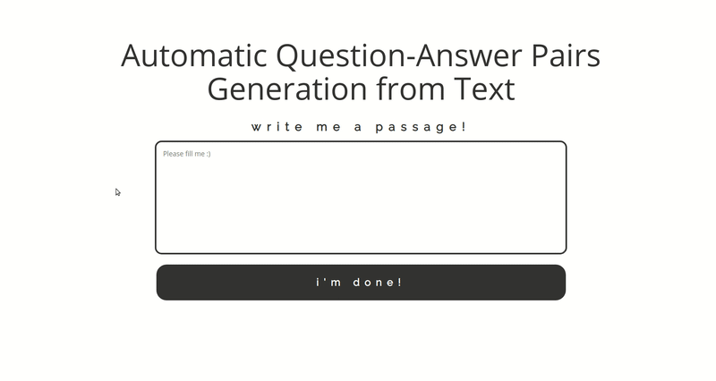

# Automatic Question-Answer Pairs Generation from Text

## Members

1. [Holy Lovenia](https://github.com/holylovenia)

2. [Agus Gunawan](https://github.com/agusgun)

3. [Felix Limanta](https://github.com/felixlimanta)

## English Paper

We have a paper (not submitted) that explains our question-answer generation system [here](docs/qag-paper-not-submitted.pdf).

## Architecture in overview

We propose an approach which is generally based on the framework of an ongoing work by [A. Sarvaiya](https://software.intel.com/en-us/articles/using-natural-language-processing-for-smart-question-generation). Formally, given a passage , question-answer generation (**QAG**) system retrieves the most important sentence  from . Then, **QAG** system produces a set of question-answer pairs , where each generated  can be found in , and its pair  is the interrogative version of  or a clause  from a set of clauses  in , without  in it. As shown in the figure below, here are four main modules  in our **QAG** system.

1. **Preprocessing**, which cleans the input passage  from unnecessary characters and shapes it into the desirable form (list of sentences).

2. **Sentence Selection**, which picks top- most important sentences  given . The text summarization method used can be chosen between TextRank, multi-word phrase extraction (MWPE), and latent semantic analysis (LSA). The chosen method ranks the sentences in P and selects the top- highest ranked sentences as the output.

3. **Gap Selection**, which selects phrases in  that can be used as answers  based on constituent tree from syntactic parser and named entity recognition (NER).

4. **Question Formation**, which creates the interrogative version of  or  in  without  to make a question  for each answer in . The final output of this module is question-answer pairs  related to .

## Result

1. Demonstration with [Jupyter Notebook](https://github.com/holylovenia/question-answer-generation/blob/master/QuestionGeneration/QG_Final.ipynb)

2. Source code for the web version is in [this GitHub repository](https://github.com/agusgun/qag-web). Check it out!

